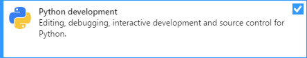
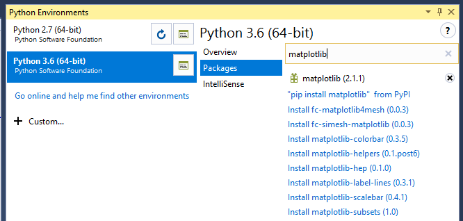
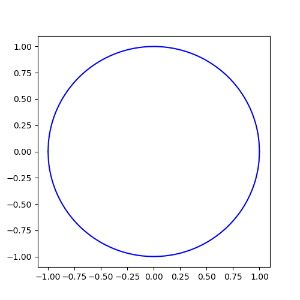
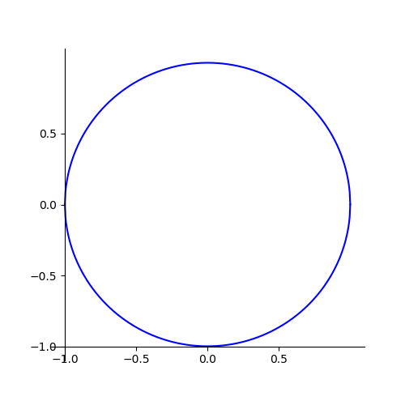
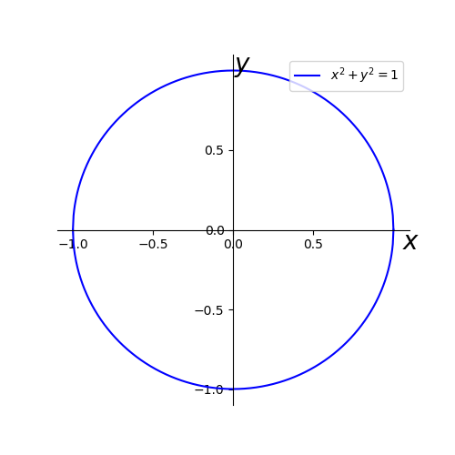

### Download Microsoft Visual Studio
Microsoft Visual Studio enables you develop your python Application, to use Microsoft Visual Studio developing your application, first thing is to install Visual Studio.
Download Microsoft Visual Studio online, [download Visual Studio](https://www.visualstudio.com/downloads/).

### Choose Python Development when installing Microsoft Visual Studio


### After installation complete, launch the Visual Studio and create a project.
1. Select **File** > **New** > **Project**
2. In the *New Project* window, expand **Installed**, expand **Python**.
3. In the template, select **Python Application**.
4. Choose your **Name** and **Location**, then click **OK**.

### Install **matplotlib** and **numpy** package
1. Select **View** > **Ohter Windows** > **Python Environments**.
2. In the right side of window, switch to **Python Environment** (In same window to the Solution Explorer).
3. Select one version, for example, Python 3.6. Select **Packages**.
4. In the search box, type **matplotlib** and select **"pip install matplotlib" from PyPI**.
5. Wait for the installation complete.  

6. Repeat above two steps for **numpy**.

### Open python file, write code to plot a circle step by step

> The equation for a circle is `x^2 + y^2 = 1`, therefore, `y = +sqrt(1-x^2)` and `y = -sqrt(1-x^2)`.

1. Select **Soltuion Explorer**, double click the python file to open it, in my side, the file name is **PythonApplication1.py**.
2. Import **pyplot** and **numpy** libraries with following code:
```python
import matplotlib.pyplot as plt
import numpy as np
```
3. Define a Figure window with name *Figure1* and size of `width=5`, `height=5`.
```python
plt.figure(num=1,figsize=(5,5))
```
4. Use `numpy.linspace` to define variable x with some dots, value from -1 to 1, and randomly generate 500 points in this range.
5. Use `numpy.sqrt` to define the variable of y1 and y2:
```python
x = np.linspace(-1, 1, 500)
y1 = np.sqrt(1-x**2)
y2 = -np.sqrt(1-x**2)
```
6. Plot the figure and show with following code:
```python
l1, = plt.plot(x, y1, color='blue')
l2, = plt.plot(x, y2, color='blue')
plt.show()
```
7. Following screenshot shows what your application get:  



### Customize your Figure
**NOTE:** all the code need be added before the line of `plt.show()`  

1. You can customize your figure by setting the steps and points in the x axs and y axs, the functions are `pyplot.xticks` and `pyplot.yticks`.
2. In following code, I defined some numbers by using `numpy.arange()`, the numbers are -1, -0.5, 0, 0.5, 1. Use these numbers both for x axs and y axs. 

```python
new_ticks = np.arange(-1,1,0.5)
plt.xticks(new_ticks)
plt.yticks(new_ticks)
```

3. If you want to change the figure border style and axis location, you can use `plt.gca()`, the following code does four things:

    + Set the position of y axis to -1.
    + Set the postion of x axis to -1.
    + Remove the border of right edge.
    + Remove the border of top edge.

```python
ax = plt.gca()
ax.spines['left'].set_position(('data',-1))
ax.spines['bottom'].set_position(('data',-1))
ax.spines['right'].set_color('none')
ax.spines['top'].set_color('none')
```

4. Now, check following screenshot to see what you get:  


5. If you want to move the axis to 0, just changing the value from -1 to 0 in above code.
```python
ax.spines['left'].set_position(('data',0))
ax.spines['bottom'].set_position(('data',0))
```
6. Add a legend to the upper right corner position, the string inside the `'` should sround with `$`, and it will render better acording to what is supported best by the system.
```python
plt.legend(handles=[l1,l2,], labels=[r'$x^2+y^2=1$'], loc='upper right')
```
7. Add axes label at the end of the axis by using `plt.annotate()`.
```python
plt.annotate('$x$', xy=(0.98,0.5), ha='left', va='top', xycoords='axes fraction', fontsize=20)
plt.annotate('$y$', xy=(0.5,1), ha='left', va='top', xycoords='axes fraction', textcoords='offset points',fontsize=20)
```
8. This is what your final figure looks like, pretty cool.  


